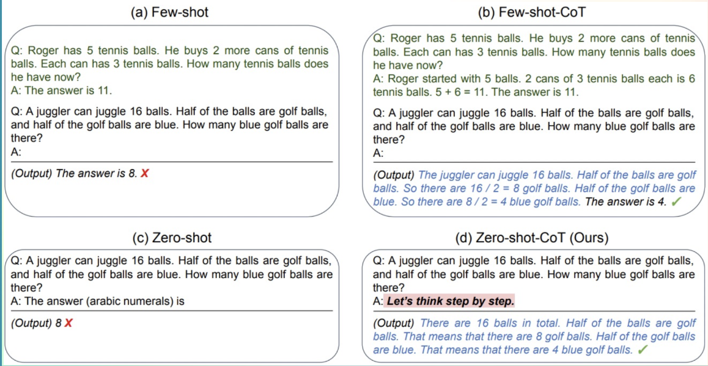

(continuation)

### Understanding AI Agents through the Thought-Action-Observation Cycle - https://huggingface.co/learn/agents-course/unit1/agent-steps-and-structure

#### The Core Components

Agents work in a continuous cycle of: thinking (Thought) → acting (Act) and observing (Observe).

Let’s break down these actions:

- *Thought*: The LLM part of the Agent decides what the next step should be.
- *Action*: The agent takes an action, by calling the tools with the associated arguments.
- *Observation*: The model reflects on the response from the tool.

#### The Thought-Action-Observation Cycle

The three components work together in a continuous loop. To use an analogy from programming, the agent uses a while loop: the loop continues until the objective of the agent has been fulfilled.

In many Agent frameworks, the rules and guidelines are embedded directly into the system prompt, ensuring that every cycle adheres to a defined logic.

In a simplified version, our system prompt may look like this:


### Thought: Internal Reasoning and the Re-Act Approach - https://huggingface.co/learn/agents-course/unit1/thoughts

Thoughts represent the Agent’s internal reasoning and planning processes to solve the task.

This utilises the agent’s Large Language Model (LLM) capacity to analyze information when presented in its prompt.

Think of it as the agent’s internal dialogue, where it considers the task at hand and strategizes its approach.

The Agent’s thoughts are responsible for accessing current observations and decide what the next action(s) should be.

Through this process, the agent can break down complex problems into smaller, more manageable steps, reflect on past experiences, and continuously adjust its plans based on new information.

Here are some examples of common thoughts:

| Type of Thought | Example |
| --- | --- |
| Planning	| “I need to break this task into three steps: 1) gather data, 2) analyze trends, 3) generate report”
| Analysis |	“Based on the error message, the issue appears to be with the database connection parameters”
| Decision Making	| “Given the user’s budget constraints, I should recommend the mid-tier option”
| Problem Solving	| “To optimize this code, I should first profile it to identify bottlenecks”
| Memory Integration	| “The user mentioned their preference for Python earlier, so I’ll provide examples in Python”
| Self-Reflection	| “My last approach didn’t work well, I should try a different strategy”
| Goal Setting	| “To complete this task, I need to first establish the acceptance criteria”
| Prioritization	| “The security vulnerability should be addressed before adding new features”

*Note: In the case of LLMs fine-tuned for function-calling, the thought process is optional. In case you’re not familiar with function-calling, there will be more details in the Actions section.*

#### The Re-Act Approach

A key method is the ReAct approach, which is the concatenation of “Reasoning” (Think) with “Acting” (Act).

ReAct is a simple prompting technique that appends “Let’s think step by step” before letting the LLM decode the next tokens.

Indeed, prompting the model to think “step by step” encourages the decoding process toward next tokens that generate a plan, rather than a final solution, since the model is encouraged to decompose the problem into sub-tasks.

This allows the model to consider sub-steps in more detail, which in general leads to less errors than trying to generate the final solution directly.

The (d) is an example of Re-Act approach where we prompt "Let's think step by step":


> We have recently seen a lot of interest for reasoning strategies. This is what's behind models like Deepseek R1 or OpenAI's o1, which have been fine-tuned to "think before answering".
These models have been trained to always include specific thinking sections (enclosed between <think> and </think> special tokens). This is not just a prompting technique like ReAct, but a training method where the model learns to generate these sections after analyzing thousands of examples that show what we expect it to do.

Now that we better understand the Thought process, let’s go deeper on the second part of the process: Act.

### Actions: Enabling the Agent to Engage with Its Environment - https://huggingface.co/learn/agents-course/unit1/actions

Actions are the concrete steps an AI agent takes to interact with its environment. Whether it’s browsing the web for information or controlling a physical device, each action is a deliberate operation executed by the agent.

#### Types of Agent Actions

There are multiple types of Agents that take actions differently:

| Type of Agent	| Description
| --- | --- |
| JSON Agent	| The Action to take is specified in JSON format.
| Code Agent	| The Agent writes a code block that is interpreted externally.
| Function-calling Agent	| It is a subcategory of the JSON Agent which has been fine-tuned to generate a new message for each action.

Actions themselves can serve many purposes:

| Type of Action | Description |
| --- | --- |
| Information | Gathering	Performing web searches, querying databases, or retrieving documents.
| Tool Usage	| Making API calls, running calculations, and executing code. **Notajota: so actions a superset of tool calling**
| Environment Interaction	| Manipulating digital interfaces or controlling physical devices.
| Communication	| Engaging with users via chat or collaborating with other agents.

One crucial part of an agent is the ability to STOP generating new tokens when an action is complete, and that is true for all formats of Agent: JSON, code, or function-calling. This prevents unintended output and ensures that the agent’s response is clear and precise.

The LLM only handles text and uses it to describe the action it wants to take and the parameters to supply to the tool.

#### The Stop and Parse Approach

One key method for implementing actions is the stop and parse approach. This method ensures that the agent’s output is structured and predictable:

1 - Generation in a Structured Format: The agent outputs its intended action in a clear, predetermined format (JSON or code).

2 - Halting Further Generation: Once the action is complete, the agent stops generating additional tokens. This prevents extra or erroneous output.

3 - Parsing the Output: An external parser reads the formatted action, determines which Tool to call, and extracts the required parameters.

For example, an agent needing to check the weather might output:

```python
Thought: I need to check the current weather for New York.
Action :
{
  "action": "get_weather",
  "action_input": {"location": "New York"}
}
```

The framework can then easily parse the name of the function to call and the arguments to apply.

*Note: Function-calling agents operate similarly by structuring each action so that a designated function is invoked with the correct arguments. We’ll dive deeper into those types of Agents in a future Unit.*

#### Code Agents

An alternative approach is using Code Agents. The idea is: instead of outputting a simple JSON object, a Code Agent generates an executable code block—typically in a high-level language like Python.


For example, a Code Agent tasked with fetching the weather might generate the following Python snippet:

```python
# Code Agent Example: Retrieve Weather Information
def get_weather(city):
    import requests
    api_url = f"https://api.weather.com/v1/location/{city}?apiKey=YOUR_API_KEY"
    response = requests.get(api_url)
    if response.status_code == 200:
        data = response.json()
        return data.get("weather", "No weather information available")
    else:
        return "Error: Unable to fetch weather data."

# Execute the function and prepare the final answer
result = get_weather("New York")
final_answer = f"The current weather in New York is: {result}"
print(final_answer)
```

This method also follows the stop and parse approach by clearly delimiting the code block and signaling when execution is complete (here, by printing the final_answer).

### Observe: Integrating Feedback to Reflect and Adapt - https://huggingface.co/learn/agents-course/unit1/observations

Observations are how an Agent perceives the consequences of its actions.

They provide crucial information that fuels the Agent’s thought process and guides future actions.

They are signals from the environment—whether it’s data from an API, error messages, or system logs—that guide the next cycle of thought.

In the observation phase, the agent:

- Collects Feedback: Receives data or confirmation that its action was successful (or not).
- Appends Results: Integrates the new information into its existing context, effectively updating its memory.
- Adapts its Strategy: Uses this updated context to refine subsequent thoughts and actions.

For example, if a weather API returns the data “partly cloudy, 15°C, 60% humidity”, this observation is appended to the agent’s memory (at the end of the prompt).

The Agent then uses it to decide whether additional information is needed or if it’s ready to provide a final answer.

This iterative incorporation of feedback ensures the agent remains dynamically aligned with its goals, constantly learning and adjusting based on real-world outcomes.

These observations can take many forms, from reading webpage text to monitoring a robot arm’s position. This can be seen like Tool “logs” that provide textual feedback of the Action execution.

| Type of Observation | Example |
| --- | --- |
| System Feedback | Error messages, success notifications, status codes
| Data Changes | Database updates, file system modifications, state changes
| Environmental Data | Sensor readings, system metrics, resource usage
| Response Analysis | API responses, query results, computation outputs
| Time-based Events | Deadlines reached, scheduled tasks completed

#### How Are the Results Appended?

After performing an action, the framework follows these steps in order:

- Parse the action to identify the function(s) to call and the argument(s) to use.
- Execute the action.
- Append the result as an Observation.

We’ve now learned the Agent’s Thought-Action-Observation Cycle.

Now, it’s time to put your knowledge into practice by coding your very first Agent!

### Dummy Agent Library - https://huggingface.co/learn/agents-course/unit1/dummy-agent-library

I put my notebook code [here](dummy_agent_library.ipynb)

### Let’s Create Our First Agent Using smolagents

Overview about smolagents: https://huggingface.co/blog/smolagents

My clone is here: https://huggingface.co/spaces/lokijota/First_agent_template/tree/main

I have just added the duckduckgo agent to the configuration.
Going to the files, I don't quite understand what's in the `prompts.yaml` file. Seems like the overal configuration of the agent? the file `agent.json` also has prompt-like configurations with the same sections as `prompts.yaml`

[Continue to Bonus Unit 1](02.BonusUnit1.md)